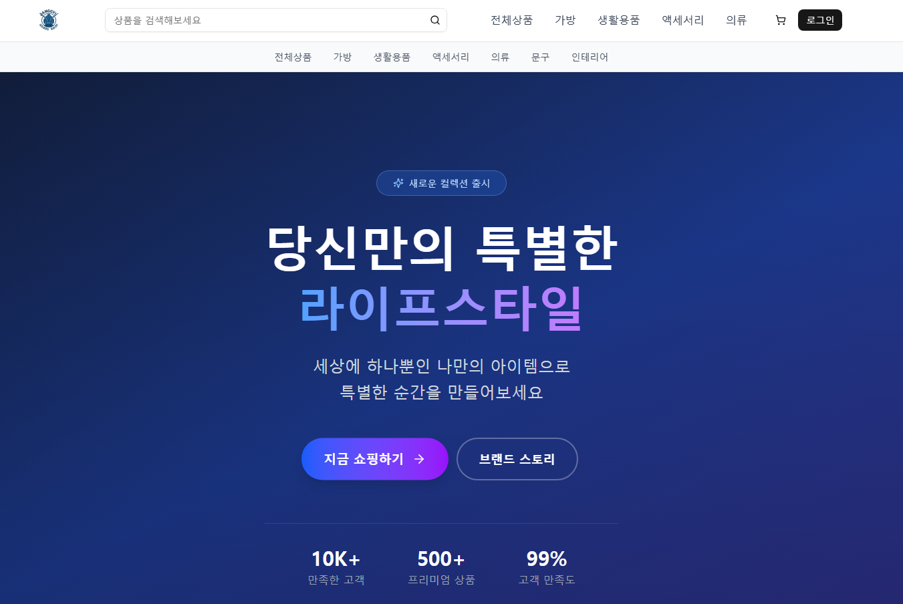
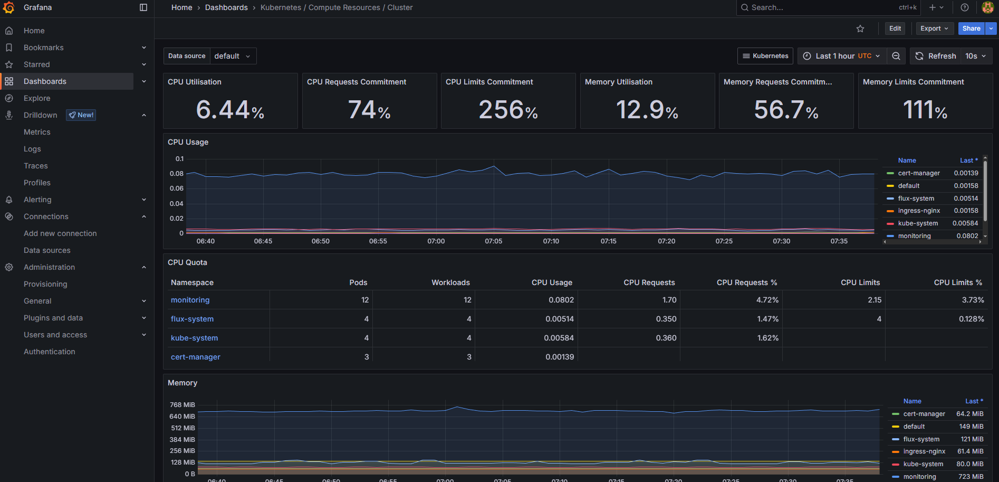
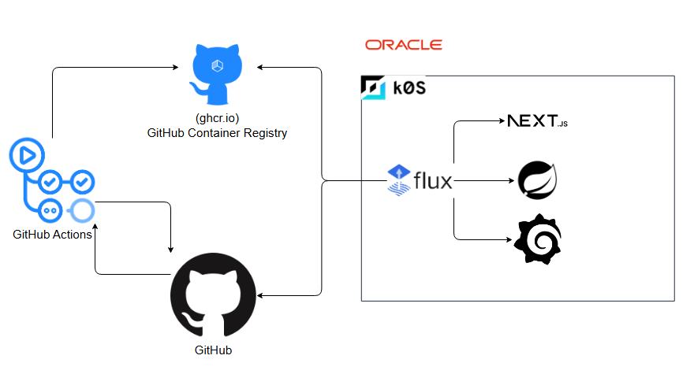
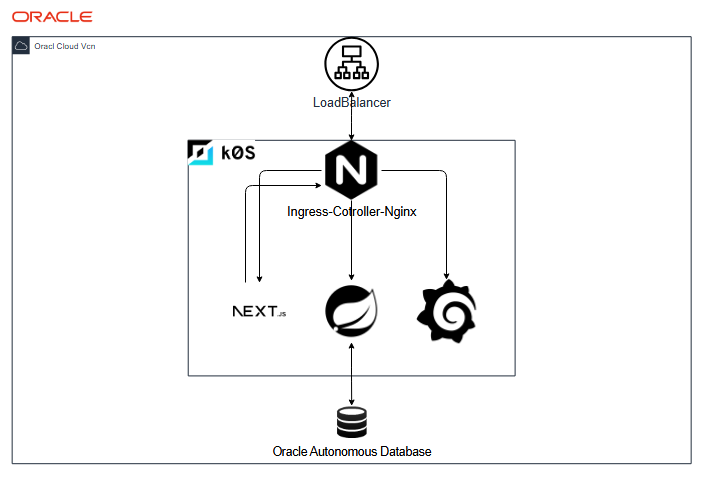

# Kubernetes 기반 E-Commerce 서비스

**Kubernetes를 기반으로 지금까지 배운 내용을 정리하며 향후 MSA 및 MLOps 적용을 목표로 확장해나가는 프로젝트입니다.**  

**소개 GIF**
 

  

  

  

 

## 📚 목차 (Table of Contents)

1.  [프로젝트 개요 (Overview)](#1-프로젝트-개요-overview)
2.  [주요 기능 (Features)](#2-주요-기능-features)
3.  [기술 스택 (Tech Stack)](#3-기술-스택-tech-stack)
4.  [아키텍처 (Architecture)](#4-아키텍처-architecture)
    - [시스템 구성 및 서비스 흐름](#시스템-구성-및-설계-의도)
    - [인프라 구성 및 자동화](#인프라-구성-및-자동화)
    - [CI/CD 파이프라인 (GitOps)](#cicd-파이프라인-gitops)
5.  [트러블슈팅 및 학습 과정 (Troubleshooting)](#5-트러블슈팅-및-학습-과정-troubleshooting)
6.  [향후 개선 계획 (Future Plan)](#6-향후-개선-계획-future-plan)

 

## 1. 프로젝트 개요 (Overview)

-   **개발 기간**: 2025.06.27 ~ 진행 중
-   **주요 목표**:
    - Kubernetes(k0s) 환경에서의 애플리케이션 배포 및 운영 경험
    - MSA 전환을 고려한 확장 가능한 모놀리식 아키텍처 설계 능력 향상
    - MLOps 파이프라인 구축 및 추천 시스템 적용을 통한 AI 역량 강화

 

## 2. 주요 기능 (Features)
> **범례**: 🟢 구현 완료, 🟡 개발 진행 중, 🔴 구상 및 설계 단계

#### 인프라 구축 및 CI/CD
- 🟢 k0s를 활용하여 단일 노드 Kubernetes 클러스터 구축
- 🟢 GitHub Actions와 Flux CD를 이용한 GitOps 기반 배포 자동화 파이프라인 구현
- 🟡 Terraform 및 Ansible

#### 회원 관리 시스템
- 🟢 Spring Security와 JWT를 이용한 인증/인가 기능의 핵심 로직 구현
- 🟡 회원가입, 로그인, 정보 수정 등 주요 API 개발 진행 중

#### 상품 및 주문 시스템
- 🟡 상품 등록, 조회, 재고 관리 등 핵심 비즈니스 로직 구현 중
- 🔴 주문 및 결제 프로세스

 

## 3. 기술 스택 (Tech Stack)

| 구분                  | 기술                                                        |
| --------------------- | ----------------------------------------------------------- |
| **Frontend** | Javascript, React, Next.js         |
| **Backend** | Java, Spring Boot, Spring Data JPA, Spring Security         |
| **Infrastructure** | Kubernetes (k0s), Docker, Nginx                           |
| **DevOps & CI/CD** | GitHub Actions, Flux CD, Terraform, Ansible               |
| **Database** | Oracle                                           |
| **Monitoring** | Prometheus, Grafana, Loki                        |

 

## 4. 아키텍처 (Architecture)

  

  

### 시스템 구성 및 설계 의도
현재 아키텍처는 프론트엔드와 백엔드가 분리된 구조이며, 모두 단일 애플리케이션으로 구성된 모놀리식 아키텍처입니다. 빠른 개발 속도와 관리의 용이성을 위해 이 구조를 채택했습니다. 또한, 쿠버네티스 안에서 레플리카수를 2로 지정하여 단일 장애점을 방지하였습니다.

### 인프라 구성 및 자동화
클라우드 비용 문제로 인스턴스를 자주 재생성해야 하는 비효율이 발생했고, 이를 해결하고자 Terraform과 Ansible을 도입했습니다. Terraform으로 인프라를 코드로 관리(IaC)하고, Ansible로 노드의 초기 설정을 자동화하여 수동 작업의 반복을 줄여나가고 있습니다. 오케스트레이션 도구로는 설치가 간편하고 리소스 요구사항이 낮은 경량 Kubernetes 배포판인 k0s를 채택하여 낮은 성능과 학습 환경에 최적화했습니다.

### CI/CD 파이프라인 (GitOps)
CI/CD 도구로는 GitHub Actions를 사용했습니다. 소스 코드 저장소인 GitHub과의 연동성이 뛰어나고, 별도의 서버 구축 없이 YAML 파일로 손쉽게 워크플로우를 관리할 수 있습니다. 이 파이프라인을 통해 Docker 이미지가 빌드 및 푸시되고, 버전 정보가 변경되면 FluxCD를 통해 감지되어 클러스터에 적용됩니다.

 

## 5. 트러블슈팅 및 학습 과정 (Troubleshooting)

#### Kubernetes(k0s) 클러스터 외부 접속 불가 문제
- k0s 클러스터 구축 후, Ingress를 통한 외부 접속이 불가한 문제를 해결했습니다.
- 원인은 클라우드 보안 정책(VCN/NSG)의 포트설정과 Ingress Controller의 모드설정 이었습니다. IngressController를 호스트 네트워크 모드로 설정하고 포트를 80,443으로 설정하여 로드밸런서 도입 전 임시적으로 문제를 해결했습니다.

#### Cert-Manager HTTPS 인증서 발급 실패 문제
- Cert-Manager의 TLS 인증서 자동 발급 실패 문제를 해결했습니다.
- 로그 분석 결과, Helm 설치 시 CRD(Custom Resource Definition)가 늦게 생성되는 문제와 Ingress의 정규식 경로 차단이라는 두 가지 원인을 발견했습니다. Helm 차트의 CRD 설치 옵션만으로는 해결이 되지않아, 미리 CRD를 설치할수 있도록 자동화 했습니다. 또한, Ingress의 정규식 설정을 변경하여 문제를 해결했습니다.

 

## 6. 향후 개선 계획 (Future Plan)

#### 머신러닝 추천 시스템 도입:
  - 사용자 구매/조회 이력 데이터를 기반으로 한 상품 추천 모델 개발  
  - 모델 학습 및 배포, 서빙을 위한 MLOps 파이프라인 구축  

#### 모니터링 시스템 고도화:
  - 모니터링 시스템 세부 설정 및 알림 연동  

#### MSA 구조 도입:
  - API Gateway 도입 및 서비스 간 통신 안정성 확보  
